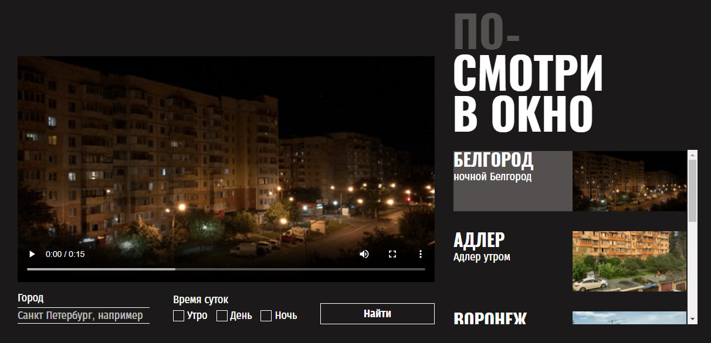

https://github.com/AlanWakeKing/posmotri_v_okno.git

<h2>Яндекс.Практика. Практическая работа "Взгляд из окна"</h2>

<h2 aling="center">Оглавление</h2>

- [Скриншот](#скриншот)
- [Описание](#описание)
- [Автор](#автор)

<h2 aling="center">Скриншот</h2>

<h2 aling="center"> Описание</h2>

Данное приложение позволяет "выглянуть" из окон самых разных городов мира.

<h2 aling="center">Автор</h2>

- Github - [AlanWakeKing](https://github.com/AlanWakeKing)